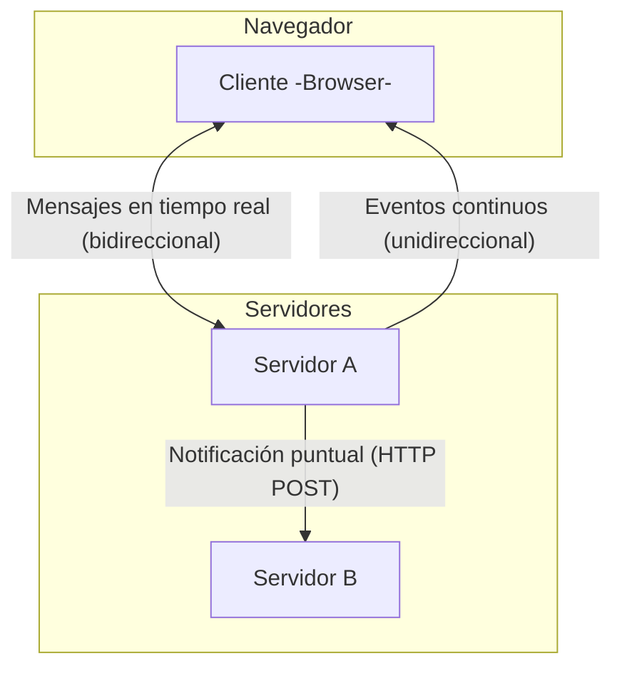

La comunicación en tiempo real es un requisito clave en las aplicaciones modernas. Desde actualizar interfaces al instante hasta integrar servicios externos o habilitar chats en vivo, los sistemas actuales necesitan enviar y recibir información sin depender de recargas manuales o peticiones constantes.

Entre las tecnologías más utilizadas para lograrlo se encuentran tres enfoques distintos: **Server-Sent Events (SSE)**, **Webhooks** y **WebSockets**. Aunque todos se basan en el concepto de “emisor y receptor de eventos”, cada uno responde a un escenario particular.

---

## 🔹 Server-Sent Events (SSE)

Los **SSE** permiten al servidor enviar actualizaciones continuas a un cliente a través de una conexión HTTP persistente. Una vez establecida la conexión, el cliente “escucha” y recibe los datos en tiempo real sin necesidad de hacer nuevas peticiones.

* **Direccionalidad**: unidireccional → servidor ➝ cliente.
* **Uso típico**: dashboards, notificaciones en vivo, actualizaciones de feeds.
* **Limitación**: el cliente no puede enviar datos por ese canal; debe usar peticiones HTTP normales (`fetch`, `POST`).

👉 **Ejemplo**: un tablero de control de bolsa que actualiza los precios en tiempo real directamente en el navegador.

> *“Los SSE son ideales cuando se necesita mantener a muchos usuarios informados de cambios constantes, sin recargas ni peticiones redundantes.”*

---

## 🔹 Webhooks

Un **webhook** es una notificación que un servidor envía a otro cuando ocurre un evento específico. En lugar de mantener una conexión abierta, funciona de manera puntual: el sistema emisor lanza un `POST` HTTP al receptor en cuanto ocurre algo relevante.

* **Direccionalidad**: unidireccional → servidor A ➝ servidor B.
* **Uso típico**: automatización de procesos, integraciones entre servicios, pagos en línea.
* **Limitación**: la respuesta del receptor suele limitarse a confirmar la recepción (`200 OK`), no hay intercambio continuo de datos.

👉 **Ejemplo**: Stripe envía un webhook a tu backend cuando se completa un pago, lo que dispara la activación automática de un servicio premium.

---

## 🔹 WebSockets

Los **WebSockets** ofrecen un modelo diferente: establecen una conexión persistente y bidireccional entre cliente y servidor sobre TCP. Esto significa que ambos pueden enviarse mensajes en cualquier momento, sin necesidad de nuevas solicitudes HTTP.

* **Direccionalidad**: bidireccional → cliente ⇄ servidor.
* **Uso típico**: chats, videojuegos online, colaboración en documentos, transmisiones interactivas.
* **Ventaja**: permiten comunicación en tiempo real fluida en ambos sentidos.

👉 **Ejemplo**: un chat en el que los usuarios envían y reciben mensajes de inmediato gracias a la conexión activa con el servidor.

---

## 🔹 Comparativa entre SSE, Webhooks y WebSockets

| Tecnología     | Quién envía        | Quién recibe        | Tipo de conexión    | Direccionalidad | Uso típico                                 |
|----------------|--------------------|---------------------|---------------------|-----------------|--------------------------------------------|
| **SSE**        | Servidor           | Cliente (navegador) | HTTP persistente    | Unidireccional  | Notificaciones, feeds, dashboards          |
| **Webhooks**   | Servidor A         | Servidor B          | HTTP puntual (POST) | Unidireccional  | Pagos, integraciones entre servicios       |
| **WebSockets** | Cliente y servidor | Cliente y servidor  | TCP persistente     | Bidireccional   | Chats, juegos, colaboración en tiempo real |

---

## 🔹 Diagrama de flujos

Para visualizar estas diferencias, este diagrama muestra cómo se relacionan los emisores y receptores en cada caso:

---

## 🔹 Una visión común: el patrón emisor-receptor

Pese a sus diferencias, todas estas tecnologías comparten una idea central:

* **Existe un emisor de eventos.**
* **Existe un receptor que actúa en consecuencia.**

La elección depende de **quién necesita la información** (cliente o servidor) y de si la comunicación debe ser **unidireccional o bidireccional**.

---

## Conclusión

* **SSE** es la mejor opción para mantener informados a los usuarios finales en tiempo real, directamente en el navegador.
* **Webhooks** permiten que los sistemas se integren entre sí y reaccionen automáticamente a eventos específicos.
* **WebSockets** habilitan la interacción en tiempo real en ambos sentidos, ideal para aplicaciones colaborativas y experiencias interactivas.

La clave está en seleccionar la herramienta adecuada según el flujo de comunicación que se desee implementar.

**¿Está tu arquitectura preparada para aprovechar el modelo de comunicación en tiempo real que mejor se ajusta a tus necesidades?**

