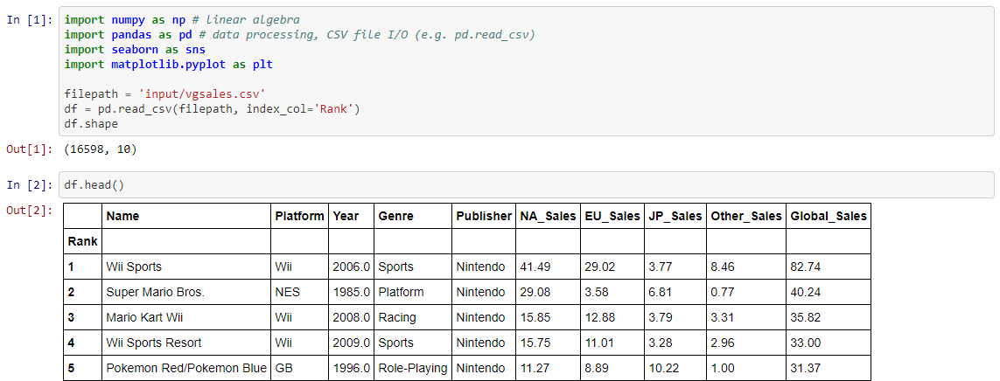
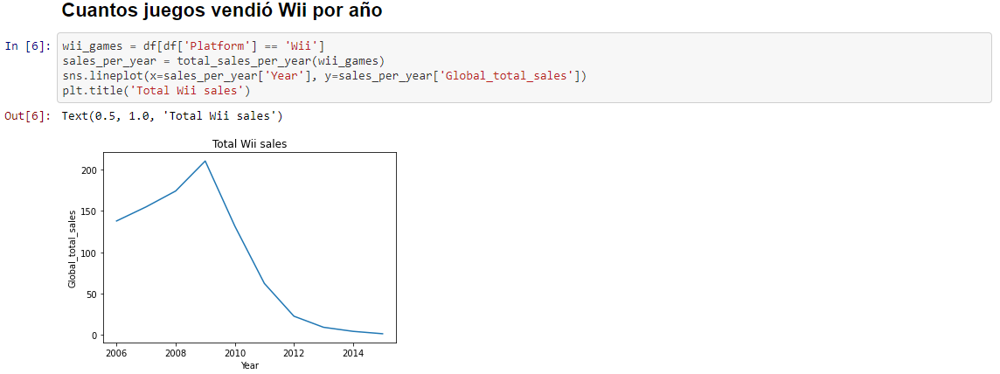

Cuando me inicié en este mundo no tenía claro que diferenciaba un notebook de un script de Python con texto de por medio. Ahora que ya he normalizado su uso puedo mirar atrás y comentar las principales ventajas que le veo.

## Los datos se mantienen en memoria

La principal ventaja que veo a trabajar con notebooks en la fase de exploración de los datos, si tenemos cuidado, es que la lectura inicial de los datos desde el origen ocurre una vez aunque "rompas" los datos.

Me explico, normalmente al inicio solemos leer desde un recurso externo (archivo CSV, API, base de datos, etc.) y guardamos esta información en una variable. Este proceso puede ser más o menos costoso dependiendo del volumen de los datos. Si por alguna razón modificamos los datos guardados en esta variable tendremos que volver a leer la toda la información.

Lo bueno que tiene los notebooks es que este proceso de lectura inicial queda aislado en el primer bloque de código el cual no vuelves a ejecutar hasta que creas una sesión nueva.

¿A qué me refiero con que queda aislado? En los notebooks podemos ejecutar solamente el código que se ejecuta dentro de un bloque específico. Teniendo esto en cuenta, podemos tener un primer bloque que inicia las variables con los datos crudos y luego tener variables nuevas las cuales son una copia del conjunto de datos inicial con el que trabajaremos.

De esta manera si borramos o modificamos la información que había en el conjunto inicial no necesitamos leer de nuevo desde el origen de los datos, ya que tenemos en memoria el conjunto de datos inicial en esta primera variable.

En este caso podemos ver como tenemos un bloque inicial dónde cargamos las librerías y los datos con los que vamos a trabajar en la variable `df` y posteriormente hacemos una asignación en `wii_games` del sub-conjunto de datos

## No tenemos que ejecutar constantemente

A diferencia de un script el cual si o si tienes que ejecutar desde el inicio para poder ver un resultado en los notebooks, como mencionamos en el apartado anterior, basta con ejecutar un bloque de código específico. En todo momento tenemos cargadas las variables y funciones que hemos ejecutado previamente. Podemos decir que se trata de un script dinámico.

Esto tiene sus inconvenientes, si tenemos una función de ayuda en un bloque de código el cual no hemos ejecutado aún porque está por debajo del actual o porque no hemos ejecutado todos los bloques en esa sesión no tendremos disponible la función. Al final tenemos que tener en cuenta, al igual que un script, el orden de ejecución de los bloques si queremos evitar problemas más adelante.

Es por esto que es más fácil trabajar con prueba y error, pues si ejecutamos un bloque y falla bastará con hacer las modificaciones que creamos y ejecutar de nuevo, sin necesidad de lanzar todo el código anterior si ya ha sido ejecutado.

## Fácil de compartir con un usuario no técnico

Por último, estos documentos son fáciles de compartir con usuarios no técnicos. Podemos configurar un notebook para ocultar piezas de código que no aporten a quien vamos a compartir y solamente vea el resultado final de la operación con un texto aclarativo. De igual forma, podemos crear informes dinámicos los cuales muestren resultados en función de los datos de entrada.

Esto último es muy útil si, por ejemplo, mensualmente tenemos que mostrar los resultados de ventas, devoluciones y otros datos de nuestro producto y esta información nos viene por un fichero externo en CSV con un formato conocido. Podemos calcular lo que necesitemos y mostrar resultados según el archivo que carguemos cada vez.
