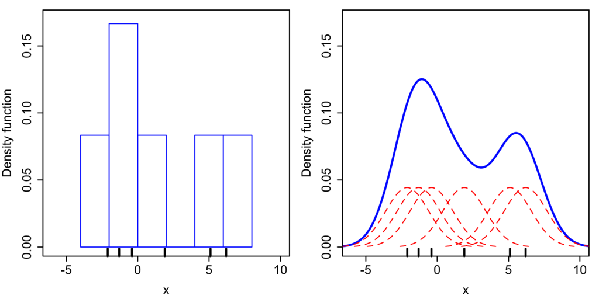

Existen multitud de gráficos para visualizar la distribución de nuestros datos y poder ver patrones. Hoy le toca el turno a dos gráficos con los que podremos ver de mejor forma como se distribuye la frecuencia de aparición de una variable respecto de otra. Estamos hablando del histograma (histogram) y el kernel density estimate (KDE, no sé cómo traducirlo 🤷‍♀️)

## Histograma

Un histograma no es una gráfica de barras, puede parecerlo pero tiene diferencias como que en este caso el valor por el que se distribuyen nuestra frecuencia no es un valor categórico, es continuo. ¿Esto que quiere decir?

Con esto nos referimos a que el eje de las X no está separado por grupos de manera natural (como puede ser el estado de una tarea; pendiente, hecho, por hacer) en este caso es continuo y existen infinitos valores entre un punto y el siguiente. Es por esto que, en este tipo de gráficos tenemos que agrupar nuestros valores en clases (**bins**). Estas clases simplemente son un rango para poder hacer la agrupación por ejemplo, si tenemos valores desde 0 hasta 1 podríamos decidir agruparlos en clases de 1. Esta primera clase, va a tener una barra para los valores que se encuentran en este rango [0, 1), otra para [1, 2) y de esta forma todos los valores o nos puede interesar agrupar en rangos de dos. Esto dependerá del uso que le queramos dar y los valores que tengamos disponibles.

A diferencia de los gráficos de barras, los histogramas no pueden ordenarse por frecuencia de aparición ya que pierden el sentido de continuidad y lo que representan. Con un histograma podemos ver como se distribuyen los datos.

## Kernel Density Estimate (KDE)

Este tipo de gráficos funciona de forma similar que el histograma que hemos visto anteriormente con la diferencia de que en este caso muestra de manera continua la evolución de los valores en lugar de separarlos por rangos.

De igual forma podemos ver la evolución de una variable respecto de otra.

Con este tipo de gráficas, como su propio nombre indica, podremos identificar patrones referentes a la distribución de los datos como puede ser el rango con mayor frecuencia de aparición, etc.

## Recursos

- [https://corporatefinanceinstitute.com/resources/excel/study/histogram/](https://corporatefinanceinstitute.com/resources/excel/study/histogram/)
