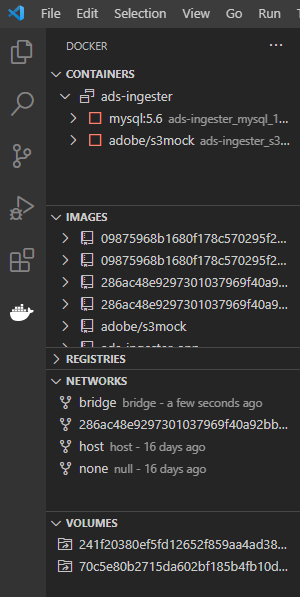
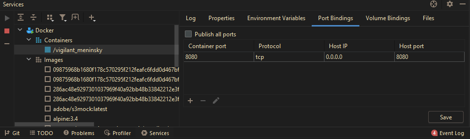

Si eres de esas personas que no le gusta mucho trabajar desde el terminal o, simplemente tienes un día en el que no te apetece escribir mucho, estás de enhorabuena. Existen varias extensiones tanto para Visual Studio Code como intellij con las que podrás gestionar docker, sus contenedores y mucho más.

## Visual Studio Code

Para este editor existen dos extensiones que harán tú día a día con Docker mucho más cómodo. La primera de ellas tiene prácticamente todo lo que necesitas: auto completado, crear imágenes con tan solo hacer click derecho en un dockerfile y decirle que haga el build y la parte que más me gusta un panel dónde puedes gestionar todo, TODO 😲

Este panel se abre cuando pulsamos sobre la extension y podremos ver todos nuestros contenedores arrancados o parados. Las imágenes que tenemos localmente y sus diferentes etiquetas, volúmenes, redes y lo que más me gusta podremos hacer limpieza de manera cómoda y visual.

Y esto es solo lo que destaco de esta extensión para Docker, si quieres saber más no dudes en consultar su documentación

[Docker - Visual Studio Marketplace](https://marketplace.visualstudio.com/items?itemName=ms-azuretools.vscode-docker)

### Conectarme a un contenedor

Si a esta primera extensión le sumamos la que te voy a presentar a continuación podrás salir de más de un apuro.

En ocasiones me ha pasado que estoy desarrollando y dentro de un contenedor el código no funciona como yo quiero y no tengo logs o necesito revisar si el código está tal cual yo espero. Esto lo puedo hacer desde consola, accediendo a los ficheros por terminal pero, porque no hacerlo con un editor 😉

Con esta extension podemos ir a nuestro apartado de contenedores, dar click derecho y seleccionar "Attach Visual Studio Code". Después de unos segundos tendremos un editor el cual está conectado directamente al contenedor. Con él podremos acceder y modificar ficheros dentro del mismo además de, tener tantas terminales como queramos sin problema alguno.

[Remote - Containers - Visual Studio Marketplace](https://marketplace.visualstudio.com/items?itemName=ms-vscode-remote.remote-containers)

## Intellij

Si en tu caso usas el Intellij tengo buenas y no tan buenas noticias para ti. Existe la posibilidad de hacer esto mismo desde nuestro Intellij IDEA. Podemos gestionar nuestros contenedores e imágenes de manera visual y cómoda, ver un resumen de cada contenedor, que puertos expone, abrir un terminal asociado con el mismo, etc. Pero, no podremos abrir un IDE asociado al contenedor como hemos visto hace un momento.

Todo ello desde la pestaña de "servicios"

Y ahora es cuando te cuento la parte no tan buena... esta funcionalidad a día de hoy solo está disponible en la versión ultimate de este editor. Así que tendrás que tener una licencia para poder hacer uso de ella 🙄
