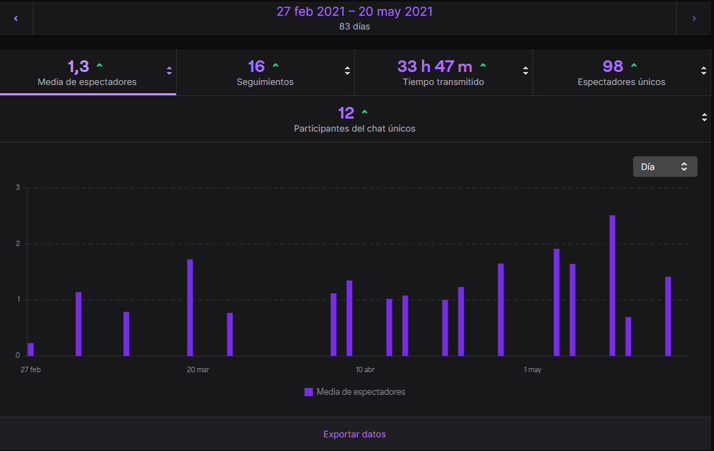

Hace unos días una compañera me preguntó: ¿hey qué tal llevas eso de hablar solo? y pensé: "ostras, ha notado que estoy loco 😅" pero antes de que hablase me aclaró. Me refiero a los directos en [Twitch](https://www.twitch.tv/cristian_suarez_dev) y demás, ¿Qué tal vas?

## Sensaciones

Ciertamente, no sé muy bien como explicarlo. Han sido muchas sensaciones en tan poco tiempo. Al inicio choca bastante, empiezas el directo y no sabes bien que hacer... ¿Empiezo ya a hablar o espero que alguien entre? ¿Voy contando lo que estoy haciendo o espero que alguien pregunte? ¿Hablo más alto o más bajo? ¿Se me escucha? Muchas preguntas que nadie va a responder y nunca sabrás la respuesta pues cada uno de nosotros debería de encontrar su estilo.

Una vez empecé [el primer directo](https://www.youtube.com/watch?v=kQArtNuLv4o&list=PLZh1qmaTeQ-qvyJ9GOLNEwESIGTQdHAoI&index=1&t=0s) con la motivación iba narrando todo lo que contaba con muchos ánimos y energía, pero al poco tiempo (apenas 15 min) todo iba decayendo y terminaba casi que susurrando para mis adentros. Esto es algo de lo que no me daba cuenta y gracias a que he subido a [Youtube](https://www.youtube.com/playlist?list=PLZh1qmaTeQ-qvyJ9GOLNEwESIGTQdHAoI) todas las sesiones y que he pedido a personas cercanas que revisen los vídeos y me hagan comentarios al respecto he podido ir mejorando.

Como iba diciendo, empiezas no hay nadie viendo y se te puede llegar a olvidar de que te podrían estar viendo, en mi caso no ha supuesto problema, no he sentido tensión o nervios, estoy acostumbrado a compartir pantalla mientras trabajo con mis compañeros.

La primera vez que alguien te sigue, no sabes qué hacer. Intentas agradecerle que te esté siguiendo, pero cuando vas a leer el nombre... No sabes ni por dónde empezar o donde hacer las pausas un show 😂 Y luego, la primera persona que te pregunta algo en el chat, con suerte te das cuenta de ello y puedes responderle... En mi caso no fue así y tardé bastante tiempo en percatarme (lo siento 😢)

Ahora que ya llevo más de 30 horas de directos la cosa cambia. No tengo ese problema de ir bajando los ánimos (muy a menudo) he visto que lo que a mi mejor me funciona es narrar constantemente lo que hago y que estoy penando. Me he acostumbrado a hablar tanto rato seguido y apenas pierdo la voz al terminar. Me doy cuenta de cuando hablan por el chat y la verdad que le he cogido el gusto y voy a seguir con el proyecto.

## Datos

Casi no hago la primera sesión y realmente ocurrió porque me comprometí con mis compañeros (María e Isaac) cuando les dije en febrero hago mi primer directo, es uno de mis objetivos de este trimestre. Y claro... era ya día 25 y me preguntaban: "Era para febrero de este año, ¿no?"

Con estas ganas empecé un sábado 27 de febrero, con problemas, imprevistos, cosas que mejorar pero, empecé. Y ahora casi tres meses y unas 34 horas más tarde me han visto casi 100 personas 😱 que locura.

No he anunciado nada estas sesiones y aún con estas me han encontrado tantas personas, gracias.

## ¿Qué es lo que hago?

Estas sesiones son mi manera de obligarme a cumplir un reto que tengo para este 2021 el cual consiste en dedicar 100 horas a estudiar y mejorar mis habilidades y conocimientos en Big Data. He llamado al proyecto #100HorasDeDatos y los directos son la forma de verificar que realmente he dedicado el tiempo que me he propuesto.

De momento hemos repasado Python, aprendido visualización de datos con la librería Seaborn y hemos descubierto como tratar, modificar, unir y filtrar datos con la librería Pandas. Además de esto, hemos usado un conjunto de datos libres para hacer nuestras pruebas sin guías, totalmente por nuestra cuenta.

Aparte de grabar y subir a [Youtube](http://bit.ly/cristian-suarez-directos) todas las sesiones también dejamos en un directorio de [Github](https://github.com/CrisKrus/kaggle) todos los recursos que vamos usando y en [este mismo blog](https://criskrus.com/tags/big-data/) voy sacando artículos relacionados con lo que aprendemos.

Para aprender todo esto estamos usando una web bastante conocida en este ámbito, [Kaggle](https://www.kaggle.com/).

Todo el rato hablo en plural aunque parezca que estoy solo delante de la pantalla porque al final no estoy solo, 100 personas han pasado por aquí y, aunque no han dicho mucho por el chat, han ayudado a que esto ocurra y siga pasando. ¡Gracias a todos!

- [Canal de Twitch](https://www.twitch.tv/cristian_suarez_dev)
