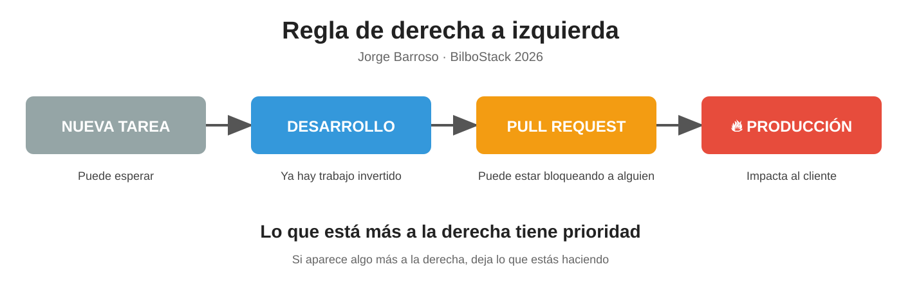

En **BilboStack 2026**, **Jorge Barroso** contó algo que no es un framework, no tiene certificación y no vende cursos. Pero a su equipo le funcionó.

La llamó: **la regla de derecha a izquierda**.

Y es absurdamente simple.

---

## ¿Qué es?

Imagina el flujo de trabajo como una línea:

Tarea sin empezar → Código en desarrollo → Pull request abierta → Código en producción

Pues lo que está más a la derecha es más importante que lo que está a la izquierda.

Siempre.

---

## Traducción a la vida real

* 🔥 Si se rompe producción, dejas lo que estés haciendo.
  Tu feature maravillosa puede esperar. El cliente no.

* 🚪 Si hay una pull request bloqueando a alguien, revisarla es más importante que avanzar tu tarea.
  Porque tu productividad individual importa menos que el flujo del equipo.

* 🛠 Si ya empezaste algo, es más importante que abrir una tarea nueva “porque te apetece”.

Nada épico. Nada revolucionario. Solo sentido común… pero escrito y repetido hasta que todo el mundo lo interioriza.

---

## ¿Por qué le funcionó?

Porque evitaba discusiones constantes de prioridad.
Porque alineaba al equipo con el impacto real.
Porque recordaba algo incómodo: lo que ya está afectando al cliente pesa más que lo que tú quieres construir.

Y sobre todo, porque convertía la prioridad en algo objetivo.

No era:
“Creo que lo mío es más importante.”

Era:
“¿Dónde está en la línea? Más a la derecha gana.”

---

## Lo interesante

No es que sea una regla perfecta.
Es que es explícita.

Muchos equipos priorizan así… pero de forma implícita, emocional y caótica.

Cuando lo haces visible, se acabó la épica individual. Empieza el trabajo en equipo.

Y la pregunta es sencilla:

**Si mañana se rompe algo, tu equipo sabe exactamente qué dejar a medias?**
