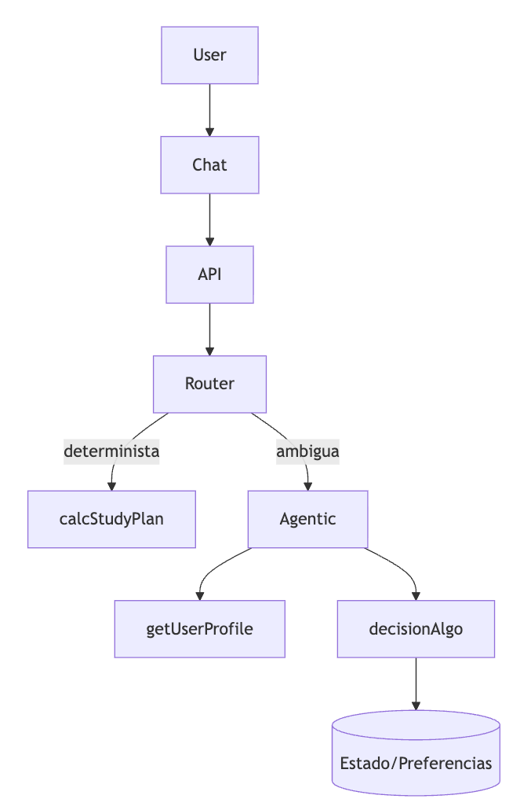

## Caso práctico con LangChain4j: asistente vertical con cálculos y preferencias

Construir un asistente vertical centrado en un dominio concreto permite maximizar el valor de LangChain4j sin caer en la complejidad de un agente generalista. Este ejemplo propone un sistema de **formación continua personal** que ofrece recomendaciones de estudio basadas en objetivos y disponibilidad del usuario.

### 1. Requisitos y alcance

El asistente:

* Recoge preferencias y disponibilidad del usuario.
* Calcula planes de estudio semanales.
* Ajusta sus recomendaciones según el progreso y feedback.

No se encarga de:

* Contenido académico ni validación de conocimientos.
* Coordinación entre múltiples usuarios o calendarios externos.

### 2. Diseño de tools

Las herramientas se centran en tres áreas:

* `getUserProfile`: Recupera objetivos y disponibilidad.
* `calcStudyPlan(hours_per_week)`: Genera un plan semanal.
* `decisionAlgo(preferences, goal)`: Evalúa si la recomendación es adecuada.

Cada tool tiene contratos de entrada/salida claros y validaciones aplicadas por el backend.

### 3. Memoria y estado

El sistema guarda información clave estructurada:

* **Preferencias**: frecuencia, estilo de aprendizaje.
* **Objetivo**: tema, nivel deseado, horizonte temporal.
* **Histórico**: planes propuestos y aceptados.

Este estado es consultado por el agente o las tools según el flujo de conversación.

### 4. Router y políticas de ruteo

Se utiliza un router determinista que decide entre:

* Calcular un plan directamente (`calcStudyPlan`) si los inputs están claros.
* Delegar al agente (`Agentic`) si hay ambigüedad o necesidad de interpretación.



[//]: # (```mermaid)

[//]: # (flowchart TB)

[//]: # (User --> Chat --> API --> Router)

[//]: # (Router -->|determinista| calcStudyPlan)

[//]: # (Router -->|ambigua| Agentic)

[//]: # (Agentic --> getUserProfile & decisionAlgo)

[//]: # (decisionAlgo --> State[&#40;Estado/Preferencias&#41;])

[//]: # (```)

### 5. Métricas de éxito y pruebas

Para evaluar el sistema se monitorizan:

* **Tasa de plan aceptado**: % de recomendaciones que el usuario confirma.
* **Tiempo a primera recomendación**: desde el inicio hasta un plan viable.
* **Satisfacción percibida**: opcional, vía encuesta.

Pruebas A/B y muestreo controlado permiten ajustar herramientas y lógica de decisión.

### Tabla de diseño de tools

| Tool             | Parámetros            | Salida                    | Ejemplo                              | Validaciones                   |
| ---------------- | --------------------- | ------------------------- | ------------------------------------ | ------------------------------ |
| `getUserProfile` | `userId`              | JSON con preferencias     | `{"goal":"certificación A","hrs":5}` | ID válido                      |
| `calcStudyPlan`  | `hours_per_week`      | Plan semanal estructurado | `[{"day":"Mon","duration":1.5}]`     | Rango horas, estructura        |
| `decisionAlgo`   | `preferences`, `goal` | Bool + motivo             | `{valid:true,reason:"OK_MATCH"}`     | Presencia de claves requeridas |

### Checklist operativo

* Datos mínimos antes de recomendar.
* Límite de tokens y pasos por sesión.
* Trazabilidad de cada plan generado.
* Pruebas A/B de distintas configuraciones.

### Preguntas frecuentes

* **¿Cómo se actualizan las preferencias del usuario?**

  * Mediante acciones explícitas (comando o botón), con validación estructurada.

* **¿Qué ocurre si hay conflicto entre objetivo y disponibilidad?**

  * El sistema lo detecta en `decisionAlgo` y ofrece alternativas realistas.

### Conclusión

Este caso práctico muestra cómo implementar un asistente vertical usando LangChain4j de forma modular, controlada y auditable. El equilibrio entre lógica determinista, herramientas bien definidas y uso puntual del razonamiento del LLM permite construir experiencias útiles sin perder trazabilidad ni eficiencia.

### Referencias a artículos relacionados

* [Workflows, Agentic y Agents en LangChain4j: el mapa para no perderse][el-mapa-para-no-perderser]
* [Diseñando un “Workflow Router” determinista delante de tu agente][workflow-router]
* [Agentic en LangChain4j: toolbox bien diseñado o caos asegurado][agentic-toolbox]
* [Memoria conversacional que sí funciona: ventana, resúmenes y “pinned facts”][memoria-conversacional]
* [Estado estructurado y decisiones deterministas: no todo va en el prompt][estado-estructurado]
* [RAG en producción: retriever ≠ razonamiento (y por qué te importa)][RAG-en-produccion]
* [Observabilidad y Evals: cómo detectar a tiempo que tu asistente se desvió][observabilidad-evals]
* [Patrones de error comunes al pasar de workflow a agente (y cómo evitarlos)][patrones-de-error]
* [Arquitectura de referencia: front de chat + backend con contexto + LC4j][arquitectura-de-referencia]

[el-mapa-para-no-perderser]: http.todo.pending
[workflow-router]: http.todo.pending
[agentic-toolbox]: http.todo.pending
[memoria-conversacional]: http.todo.pending
[estado-estructurado]: http.todo.pending
[RAG-en-produccion]: http.todo.pending
[observabilidad-evals]: http.todo.pending
[patrones-de-error]: http.todo.pending
[arquitectura-de-referencia]: http.todo.pending