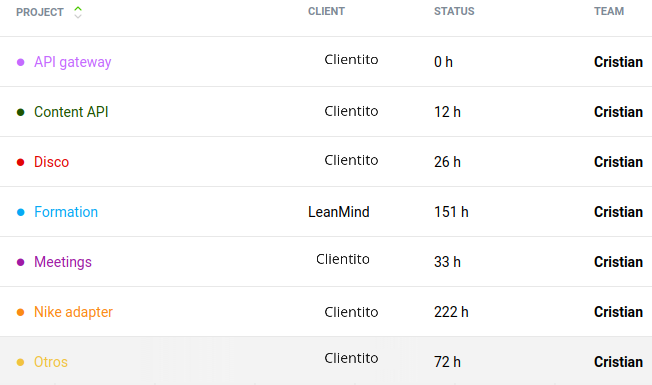

En estos días hemos estado hablando [@ulisesantana][ulisesantana] y yo sobre [Toggl]. Una herramienta de *tracking* de tiempo que llevo usando ya unos cuantos años y se ha vuelto en mi día a día casi sin darme cuenta. Con esta aplicación puedo ver como uso mi tiempo. Principalmente, la uso para controlar las tareas que hago en las horas de trabajo.

En esta publicación les voy a contar como lo tengo configurado y como hago uso de ella.

Lo primero que suelo hacer cuando empiezo en un proyecto nuevo, es crear un "__cliente__". Este cliente es __para quien__ estamos haciendo el trabajo y luego, dentro de este cliente, voy añadiendo los proyectos internos en los que estoy metidos entre otras cosas.

Como puedes ver, en mi caso tengo dos clientes principales. Uno de ellos "Lean Mind" tengo solamente el proyecto "formación" y en el caso de Clientito, según el proyecto interno tengo varios proyectos, reuniones o simplemente tiempo que no sé muy bien como clasificar (otros).

Suelo ser bastante estricto y cada vez que empiezo una tarea. Lo primero que hago es ir a [Toggl], darle al play, poner el nombre a la tarea y encajarla dentro de uno de los proyectos. Esto, de alguna forma me ayuda a centrarme en lo que estoy haciendo y pensar un poco antes de empezar.

Una vez ya estoy trabajando de vez en cuando consulto a ver cuanto tiempo llevo (sobre todo si estoy atascado) para ver si ha pasado mucho tiempo o no. Me suele pasar que me pongo a trabajar en algo y el tiempo pasa volando sin darme cuenta. De esta manera sé cuanto es ese tiempo.

Suelo obligarme a parar en caso de que no esté avanzando para alejarme un poco del problema, sobre todo si ya llevo un tiempo considerable. En estos momentos suele ser cuando reviso el correo, leo slack, contesto a compañeros, reviso PR, etc.

Cuando esto ocurre lo que me gusta hacer es volver a darle al play cuando regreso a la tarea en la que estaba sin haber parado el tiempo anterior. De esta manera contabilizo los bloques de tiempo que he dedicado a una tarea en el día.

## Ejemplo

Supongamos estoy creando un nuevo endpoint para obtener gatos. 

- Empiezo a las 10:10 y estoy hasta las 12:20. 
- Paro porque estoy atascado con algo y me paso 10 min revisando slack y demás.
- Cuando a las 12:31 vuelvo a ponerme con la tarea vuelvo a decirle a [Toggl] que estoy haciendo de nuevo la misma tarea "duplicando" la entrada.

De esta forma me ayuda a ver si me he pasado de tiempo en la última sesión de "pomodoro".

Gestionar el tiempo de esta forma me es muy útil cada mañana cuando al sentarme en el PC voy a reportar las horas de trabajo. Digo que es útil porque me basta con ir a la parte de reportes en [Toggl] y buscar el tiempo que dediqué el ayer en Clientito y ponerlo en el excel o donde toque.

También me es muy útil para mirar las horas de formación que llevo esta semana o este mes y poder dedicarle más o menos tiempo. Por ejemplo esta semana dediqué 2 horas y 19 minutos en revisar grow, preparar un artículo nuevo sobre big data.

En mi caso me es útil para no volverme muy loco con el tiempo que le dedico a las cosas. Reviso de vez en cuando y actuar en consecuencia 😸. Además de, en cada reunión diaria o semanal saber decir en que he estado trabajando para no quedarme en blanco 😂

[Toggl]: https://toggl.com/
[ulisesantana]: https://twitter.com/ulisesantana
